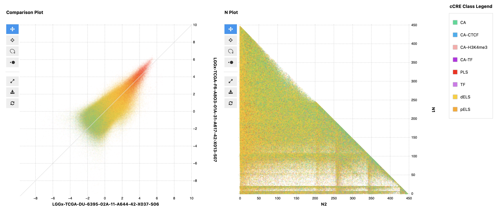

# cCRE Scatter Plot

Interactive scatter plots for analyzing candidate cis-regulatory elements (cCREs) with JScatter, featuring dynamic class filtering, and category- or density-based coloring.



## Features

- **Interactive Scatter Plots**: Built on JScatter for high-performance visualization
- **Dynamic Class Filtering**: Switch between user-defined categories
- **Flexible Coloring**: Categorical coloring with interpolated palettes or density-based coloring
- **Selection Support**: Interactive point selection with callback functions
- **Polars Integration**: Efficient data processing with Polars DataFrames

## Installation

### Using uv (recommended)

```bash
# Clone the repo
git clone https://github.com/conradbzura/ccre-scatter.git
cd ccre-scatter

# Create a virtual environment and install dependencies
uv sync
```

### Using pip

```bash
# Clone the repo
git clone https://github.com/conradbzura/ccre-scatter.git
cd ccre-scatter

# Create and activate virtual environment
python -m venv .venv
source .venv/bin/activate  # On Windows: .venv\Scripts\activate

# Install dependencies
pip install .
```

## API Reference

```python
scatterplot(x, y, metadata, join_column, category_column="class", ...)
```

Creates an interactive scatter plot with categorical coloring and filtering.

**Parameters:**

- `x` (pl.DataFrame): Dataset for X-axis values
- `y` (pl.DataFrame): Dataset for Y-axis values
- `metadata` (pl.DataFrame): Metadata with categorical information
- `join_column` (str): Column name to join datasets on
- `category_column` (str, default="class"): Column for categorical coloring/filtering
- `x_label` (str, optional): Custom X-axis label
- `y_label` (str, optional): Custom Y-axis label
- `title` (str, optional): Custom plot title
- `colormap` (Callable, optional): Function for data-driven coloring
- `default_category` (str, default="All"): Initial category filter

**Returns:**

`ScatterplotResult` named tuple with:
- `scatter`: JScatter plot object
- `merged_data`: Combined dataset (Polars DataFrame)
- `container`: Plot container widget
- `selection`: Function returning selected points
- `class_dropdown`: Class filter dropdown widget

## Example Usage

See [example_usage.ipynb](example_usage.ipynb) for detailed examples including:

- Basic categorical scatter plots
- Density-based coloring
- Custom category columns
- Programmatic interaction with plots
- Data selection and filtering
